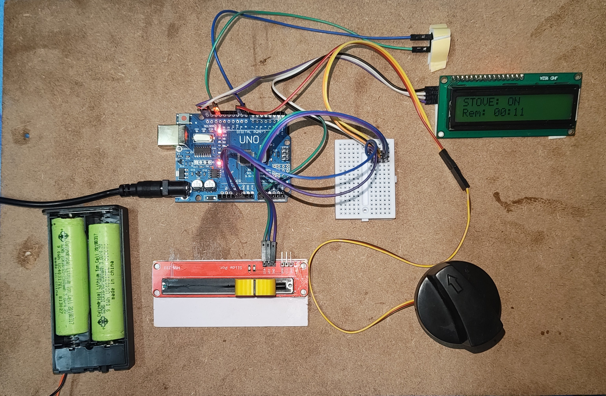
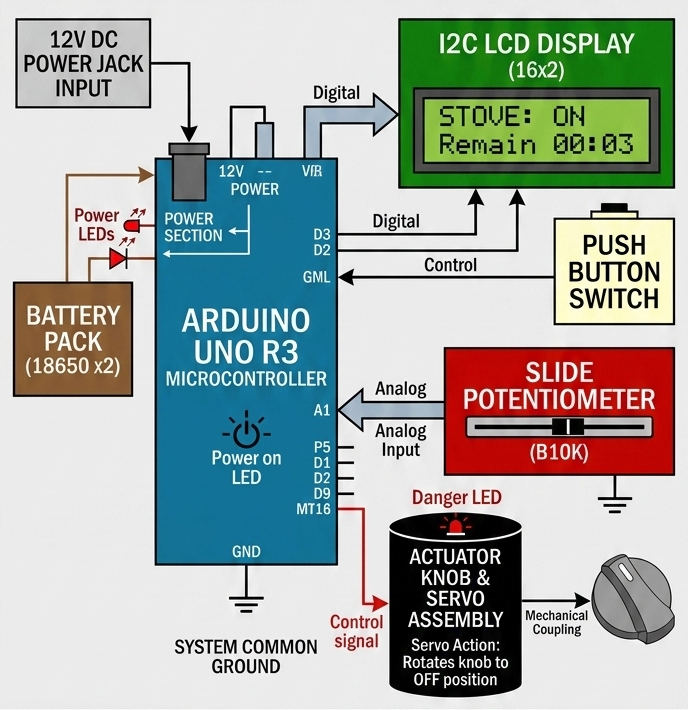

# Automated-stove-shutoff
An Arduino-based safety system that automatically shuts off a gas stove valve using a high-torque servo motor and a potentiometer-controlled countdown timer.
# Smart Gas Stove Timer & Automated Shut-Off System
# 📸 System Setup & Prototype

Here is the functional hardware layout of the project, showcasing the control core, user input, and physical actuator link:

A hardware-based safety solution designed to prevent kitchen accidents by automatically turning off a gas stove knob after a user-defined countdown timer expires. Built using an Arduino Uno/Nano, this system runs entirely offline for maximum reliability.

## 🚀 Features
* **Precise Time Input:** Uses a B10K linear potentiometer to easily dial in a cooking timer from 0 to 60 minutes.
* **Live Countdown Display:** A 16x2 I2C LCD screen displays the target cooking time and dynamically updates the remaining time (minutes and seconds).
* **High-Torque Mechanical Actuation:** Leverages an MG996R metal-gear servo motor to reliably turn stiff gas valves to the physical "OFF" position.
* **Non-Blocking Logic:** Uses `millis()` time-tracking so the system remains responsive to inputs and stops instantly when the button is pressed.
* **Audible Alerts:** Features an active buzzer to notify the user immediately when the countdown finishes and the stove is being turned off.

---

## 🛠️ Hardware Apparatus
To build this project from scratch, the following components are required:

| Component | Quantity | Purpose |
| :--- | :--- | :--- |
| **Arduino Uno / Nano** | 1 | Main microcontroller core |
| **MG996R Servo Motor** | 1 | High-torque metal gear actuator for physical knob rotation |
| **B10K Linear Potentiometer**| 1 | Analog dial to set the timer duration |
| **16x2 LCD with I2C Module** | 1 | System status and countdown display |
| **Active Buzzer** | 1 | High-decibel audio alarm upon timer completion |
| **Tactile Push Button** | 1 | Timer initialization / Start button |
| **LM2596 Buck Converter** | 1 | Steps down 12V power supply to safe 6V for the servo |
| **12V 1A DC Power Adapter** | 1 | Main system power supply |

---

## 🔌 Circuit Connection Schematic

> ⚠️ **CRITICAL POWER NOTE:** Do not power the MG996R servo motor directly from the Arduino's 5V pin. The high current draw can damage your board or cause erratic resets. Always power the motor through the buck converter (set to 6.0V) and ensure the external ground is tied together with the Arduino Ground (**Common Ground**).

| Component Pin | Connection Point | Arduino Pin | Notes |
| :--- | :--- | :--- | :--- |
| **B10K Pot (Wiper)** | Center Pin | **A0** | Analog Time Setting Input |
| **I2C LCD SDA** | Data Line | **A4** | Dedicated I2C Data |
| **I2C LCD SCL** | Clock Line | **A5** | Dedicated I2C Clock |
| **Start Button** | Output Terminal | **D2** | Employs internal `INPUT_PULLUP` |
| **Servo Signal** | Orange Wire | **D9** | PWM Control Output |
| **Buzzer (+)** | Positive Terminal | **D11** | High/Low Digital Output |

---
## Block diagram 

## 💻 Software Logic & Code Structure
The software is written in C++ using the Arduino IDE. It operates as a structured **state machine** divided into two core phases:

1.  **Setting Phase (`isRunning == false`):** The system continuously polls the analog pin connected to the potentiometer. The raw $0-1023$ value is mapped to a standard $0-60$ minute window. The chosen time is displayed live on the LCD screen while waiting for the Start button interrupt.
2.  **Countdown Phase (`isRunning == true`):** Upon pressing the button, the current time is recorded using `millis()`. The script continuously tracks the delta without freezing the processor. When elapsed time meets the target duration, the servo moves to $0^\circ$ (OFF), the buzzer sounds for 5 seconds, and the system resets to idle.

### Dependencies
Ensure you have the following libraries installed in your Arduino IDE before uploading:
* `Wire.h` (Built-in)
* `LiquidCrystal_I2C.h`
* `Servo.h` (Built-in)

---

## 🏗️ Mechanical Installation Notes
* **Rigid Mounting:** The MG996R servo exerts significant mechanical force. It must be securely bolted to a rigid metal panel or heavy 3D-printed enclosure attached firmly to the stove body to prevent flexing.
* **Emergency Manual Override:** For safety, the servo bracket should allow for easy manual disengagement or placement so that the knob can still be turned by hand in an emergency situation.

---

## 📄 License
This project is open-source and available under the [MIT License](LICENSE).
